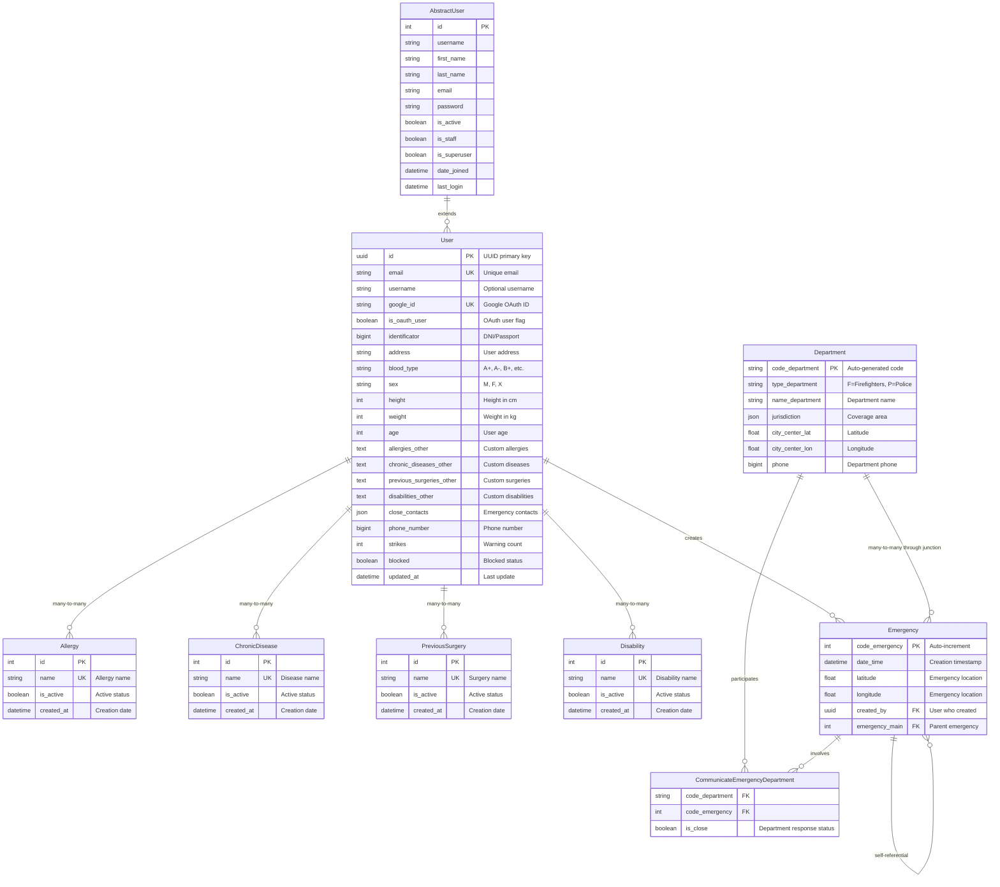

# Diagrama de Modelos - SafeOn API

## Estructura de Modelos con AbstractUser

## Explicación de la Estructura

### 1. **AbstractUser (Base de Django)**
- Modelo base de Django que proporciona funcionalidades de autenticación
- Incluye campos estándar como username, email, password, etc.
- Proporciona métodos de autenticación y permisos

### 2. **User (Modelo Personalizado)**
- **Hereda de AbstractUser**: Extiende todas las funcionalidades base
- **UUID como PK**: Usa UUID en lugar del ID entero por defecto
- **OAuth Integration**: Soporte para Google OAuth con `google_id` e `is_oauth_user`
- **Información Médica**: Campos para tipo de sangre, altura, peso, edad
- **Relaciones Many-to-Many**: Con modelos predefinidos de información médica
- **Campos Personalizados**: Para información médica no predefinida
- **Sistema de Advertencias**: Campo `strikes` y `blocked` para gestión de usuarios

### 3. **Modelos de Información Médica**
- **Allergy, ChronicDisease, PreviousSurgery, Disability**: Modelos predefinidos
- **Relación Many-to-Many**: Con el modelo User para flexibilidad
- **Campos "other"**: En User para información médica personalizada

### 4. **Department**
- **Código Auto-generado**: Basado en tipo (F/P) + número secuencial
- **Tipos**: Bomberos (F) y Policía (P)
- **Ubicación**: Coordenadas del centro de la ciudad
- **Jurisdicción**: Área de cobertura en formato JSON

### 5. **Emergency**
- **Auto-increment PK**: Código de emergencia único
- **Ubicación**: Latitud y longitud de la emergencia
- **Creador**: Referencia al User que creó la emergencia
- **Jerarquía**: Auto-referencia para emergencias relacionadas
- **Departamentos**: Relación many-to-many a través de tabla intermedia

### 6. **CommunicateEmergencyDepartment (Tabla Intermedia)**
- **Junction Table**: Para la relación many-to-many entre Emergency y Department
- **Estado de Respuesta**: Campo `is_close` para indicar si el departamento respondió

## Características Clave

1. **Herencia de AbstractUser**: El modelo User mantiene toda la funcionalidad de autenticación de Django
2. **Flexibilidad Médica**: Sistema híbrido con opciones predefinidas y campos personalizados
3. **OAuth Ready**: Preparado para autenticación con Google
4. **Sistema de Emergencias**: Estructura jerárquica con auto-referencias
5. **Gestión de Departamentos**: Sistema de códigos auto-generados y jurisdicciones
6. **Auditoría**: Campos de timestamp para seguimiento de cambios

